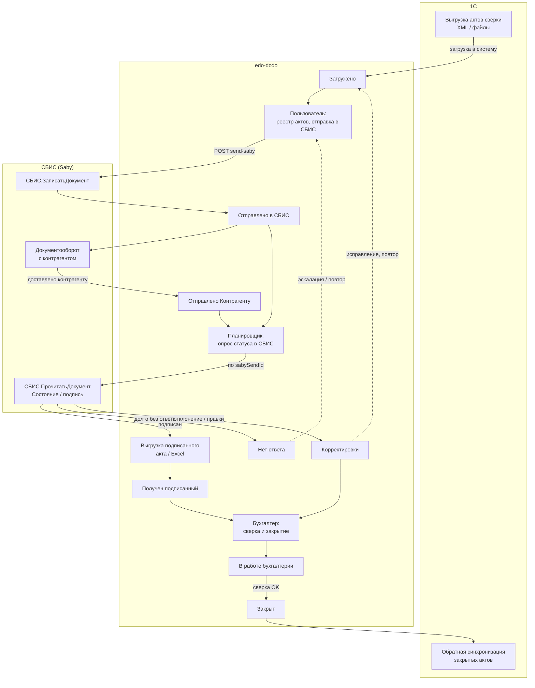

# edo-dodo — учёт и отправка актов сверки (ЭДО)

Веб-система для реестра актов сверки, отправки контрагентам через **СБИС (Saby)**, контроля статусов, очереди бухгалтерии и обратной синхронизации с **1С**.

---

## Технологический стэк

| Слой | Технологии |
|------|------------|
| **Backend** | Java 17, Spring Boot 3.5 (Web, Security, Data MongoDB, Validation, Thymeleaf) |
| **Frontend** | React 19, React Router 7, Create React App + CRACO |
| **UI** | Tailwind CSS 3, Radix UI, компоненты в стиле shadcn/ui |
| **База данных** | MongoDB 7 |
| **Интеграции** | СБИС / Saby API (`online.sbis.ru`, JSON-RPC 2.0), загрузка выгрузок из 1С (XML) |
| **HTTP-клиент** | Apache HttpClient 5, `RestTemplate` |
| **Импорт / экспорт** | Apache POI (Excel), OpenCSV, Jackson |
| **Файлы** | Локальный volume `uploads` (Docker) |
| **Прокси и SPA** | Nginx (статика React, проксирование `/api/` → backend) |
| **Развёртывание** | Docker Compose (backend, frontend, mongo), multi-stage Maven → JRE 17 |

**Внешние системы:** 1С (выгрузка / обратная синхронизация актов), СБИС (ЭДО, подписание контрагентом).

---

## Бизнес-процесс

Ниже — целевая схема жизненного цикла акта: от выгрузки в 1С до закрытия и возврата данных в 1С. Статусы соответствуют модели в приложении (`ActStatus`).



> **Примечание:** реализованы загрузка актов, подписание и отправка контрагенту через API Saby (отложенный сертификат), периодический опрос статуса (по умолчанию раз в 2 минуты) и ручная смена статусов. Обратная синхронизация в 1С — целевой шаг.

**Подписание без USB на сервере:** в кабинете Saby настройте [отложенное подписание](https://saby.ru/help/integration/api/sequence/delegate) и доверьте ключ учётной записи API. В `application.yaml`: `app.saby.deferred-cert-type` = `Отложенный` или `ОтложенныйСПодтверждением`.

### Этапы (основной сценарий)

1. **1С → edo-dodo** — акты выгружаются из 1С (XML и вложения) и попадают в реестр со статусом **«Загружено»**.
2. **Отправка в СБИС** — [`СБИС.ЗаписатьДокумент`](https://saby.ru/help/integration/api/all_methods/doc) → подписание отложенным сертификатом → [`СБИС.ВыполнитьДействие`](https://saby.ru/help/integration/api/all_methods/make_doc) (отправка контрагенту); статус **«Отправлено Контрагенту»**, `sabySendId`, срок ожидания ответа (по умолчанию 10 дней, можно задать при отправке).
3. **Планировщик** (по умолчанию раз в 2 минуты) — для актов в ожидании вызывается [`СБИС.ПрочитатьДокумент`](https://saby.ru/help/integration/api/all_methods/read_doc): обновление PDF со штампом подписи (`СсылкаНаPDF`), проверка подписи контрагента. Если подписан — сохранение новых вложений, статус **«Получен подписанный»**; если срок истёк — **«Нет ответа»**.
4. **Бухгалтерия** — бухгалтер сверяет акт в очереди (**«В работе бухгалтерии»** / подписанные) и переводит в **«Закрыт»**.
5. **edo-dodo → 1С** — обратная синхронизация закрытых актов в 1С.

### Проблемные кейсы

| Ситуация | Статус в системе | Действия |
|----------|------------------|----------|
| Контрагент долго не подписывает | **Нет ответа** | Эскалация, повторная отправка, контроль на дашборде |
| Запрошены правки / отклонение | **Корректировки** → **В работе бухгалтерии** | Доработка, при необходимости возврат в **«Загружено»** и повторная отправка в СБИС |
| Контрагент в списке исключений | — | Отправка в СБИС недоступна; допустимо только закрытие вручную |

Документация API СБИС: [интеграция Saby](https://saby.ru/help/integration/api/documents), авторизация — [`СБИС.Аутентифицировать`](https://saby.ru/help/integration/api/all_methods/auth).

---

## Инструкция по запуску

### 1. Что нужно установить (один раз)

| Программа | Зачем | Ссылка |
|-----------|-------|--------|
| **Docker Desktop** | Запускает приложение в изолированном контейнере | [docker.com/products/docker-desktop](https://www.docker.com/products/docker-desktop) |

> **Важно:** после установки Docker Desktop перезагрузите компьютер.

### 2. Как запустить приложение

#### Шаг 1. Получите файлы проекта

- **Вариант А:** папка с проектом `edo-dodo` — распакуйте в удобное место.
- **Вариант Б:** репозиторий на GitHub — **Code** → **Download ZIP**, затем распакуйте.

#### Шаг 2. Запустите одним кликом

**Windows:**

1. Откройте папку проекта.
2. ПКМ в пустом месте → **«Открыть в Терминале»** (или Open PowerShell window here).
3. Выполните:

```bash
docker compose up -d
```

**macOS:**

```bash
cd ~/Downloads/edo-dodo
docker compose up -d
```

> Первый запуск: 3–5 минут (скачиваются образы).  
> Последующие: ~30 секунд.

### 3. Готово — откройте приложение

Перед первым запуском создайте в корне проекта файл `.env` (можно скопировать из `.env.example`):

```bash
APP_ADMIN_PASSWORD=ваш_надёжный_пароль
```

Перейдите в браузере: **http://localhost**

При первом открытии — страница входа. Логин: **admin**, пароль — значение из `APP_ADMIN_PASSWORD`. Сессия: **24 часа**.

После входа откроется интерфейс системы (дашборд, реестр актов, очередь бухгалтерии, исключения, настройки СБИС).
